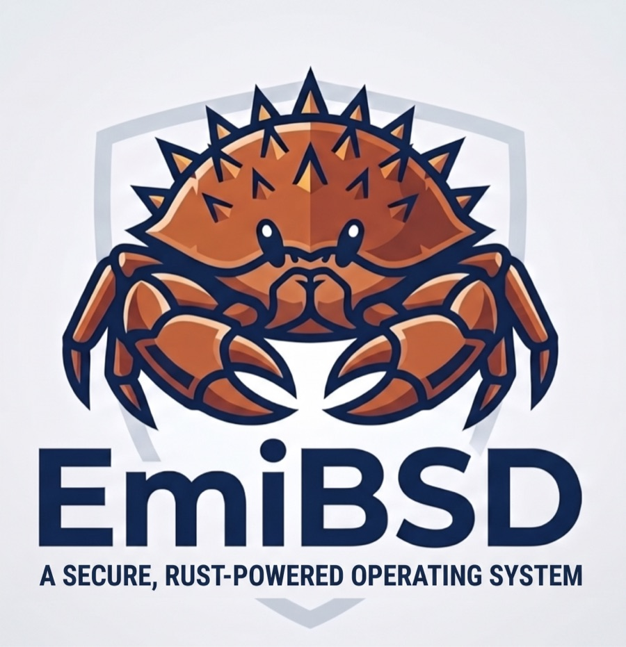

# EmiBSD

<p align="center">
  
</p>

<p align="center"><em>Ferffy, the EmiBSD mascot: half Ferris (Rust's crab), half Puffy (OpenBSD's pufferfish).</em></p>

<p align="center"><strong>The OpenBSD kernel, re-implemented in Rust, one file at a time.</strong></p>

<p align="center">License: ISC · Rust: stable (1.98.1) · Targets: amd64, arm64 · Runs in: QEMU</p>

> **Not for production.** EmiBSD is an experiment. It runs only in QEMU, and its crypto,
> network and storage code is unaudited. Do not use it to protect real data or real networks.

## What is this

- A file-by-file port of the OpenBSD kernel, pinned to commit `3ce1f3f79392` of
  [openbsd/src](https://github.com/openbsd/src) (`reference/PINNED.md`).
- Not a new kernel design, not a Rust-for-Linux style hybrid, not a wrapper around C.
- The C sources are the specification. Names, structure and semantics stay OpenBSD's.
  Every deviation is written down, in the file and in [docs/ARCHITECTURE.md](docs/ARCHITECTURE.md).
- A standalone `#![no_std]` kernel for amd64 and arm64, booted by Limine, run in QEMU.

## Status

Status: M16 (QEMU drivers) met with its last part, M16g (install images: `install80.img` on
both archs and amd64's `cd80.iso`, as `distrib/` makes them; an install from the stick with no
HTTP server); M17 (real hardware and virtualisation) next.

| Milestone | Scope | State |
|---|---|---|
| M0 | Toolchain and boot | met |
| M1 | libkern and `sys/sys` | met |
| M2 | Console, printf, panic, ddb-lite | met |
| M3 | Physical memory and uvm basics | met |
| M4 | Traps and interrupts | met |
| M5 | Timers, scheduler, proc | met |
| M6 | System calls and a minimal init | met |
| M7a, M7b | uvm (demand paging); mbufs, virtio-net, IPv4 ping | met |
| M8, M8b | OpenBSD's userland on an ffs ramdisk; multi-user boot and login | met |
| M9a..M9d | Sockets, WireGuard, IPsec, pf | met |
| M9+ | Network completion: TCP, bpf, divert, IPComp, HTTPS, tcpdump, INET6 | met |
| M10a | Persistent disk (vioblk, SCSI midlayer) | met |
| M10b | UFS options (quotas, dirhash, mfs) | met |
| M10c | Memory and removable file systems (tmpfs, msdosfs, cd9660, udf, vnd) | met |
| M10f | softraid (RAID 0, 1, 5, 6, concat, RAID 1C, CRYPTO; bio(4), bioctl) | met |
| M10e | NFS client and server (portmap, mountd, nfsd, mount_nfs, showmount) | met |
| M10d | ext2fs, ntfs (amd64), fuse | met |
| M11a | MP bring-up: APs started through Limine, the kernel lock, per-CPU run queues, SMR, percpu and pool caches, IPIs and TLB shootdowns | met |
| M11b | MP timekeeping: the TSC synchronisation test per AP, clock interrupts on every CPU | met |
| M11c | ddb on MP: the command loop, the other CPUs stopped by IPI, `machine cpuinfo`, `machine ddbcpu` | met |
| M11d | Network parallelism: one softnet task queue per CPU (up to 8), `kern_intrmap.c`, SMR for the interface index | met |
| M11e | The MP audit: every `MULTIPROCESSOR` site, MPSAFE flags and `SY_NOLOCK` honoured, unlocked page faults; every smoke runs on four CPUs | met |
| M12 | Devices in QEMU: audio(4) with azalia and auich, USB with xhci, uhub, umass and ukbd; arm64's PCI bus | met |
| M12+ | Measurement and verification: unsafe-report, JOURNAL, diff-openbsd against a real OpenBSD | met |
| M13 | Storage, firmware and console: NVMe and AHCI roots, ACPI on amd64, PSCI, the RTC, em/re/vmx, the frame buffer with wsdisplay and the USB keyboard | met |
| M14 | Installable: our efiboot on both archs, bsd.rd, install.sub with the base and comp sets (clang, lld), the installed disk booting to `login:` with `cc` working; arm64 ACPI | met |
| M15 | Code and test layout: LICENSES, CODE and TESTS zones in every `.rs` under `sys/` and `tools/`, the 324 `tests.rs` inline, validated by `ports check` | met |
| M16f | arm64 platform: agintc(4) (GICv3, LPIs, the ITS), smmu(4) (SMMUv2 and v3), gpio(4), plgpio(4) and gpiokeys(4); every arm64 smoke on `gic-version=3` | met |
| M16e | Platform drivers: UKC (`boot -c`), ppb(4), acpidmar(4) (VT-d and AMD-Vi), iic(4) with ichiic(4) and piixpm(4), ipmi(4) with the watchdog and SMBIOS, tpm(4) on swtpm, acpicpu(4) | met |
| M16b | USB drivers: ehci(4), uhci(4), ohci(4), ums(4) and uwacom(4) over hidms, uhid(4), ugen(4) with usbdevs(8), cdce(4), ucom(4) with uftdi(4), uaudio(4); ehci, and a write through ohci, behave as on OpenBSD 8.0 in QEMU | met |
| M16c | Network drivers: pcn(4), ne(4) (ne2000, dp8390, rtl80x9), fxp(4) with loadfirmware(9) and its microcode, dc(4); the inphy, lxtphy and dcphy PHYs; em(4) on igb and e1000e. tulip and igb pass no traffic, as on OpenBSD 8.0 in QEMU | met |
| M16d | Console, virtio and legacy devices: pckbc(4), pckbd(4) and pms(4); viogpu(4), viomb(4), viornd(4) with rnd(4)'s entropy pool and /dev/random, viocon(4) (cargo feature); lpt(4); pcppi(4) and spkr(4); eap(4) with midi(4) | met |
| M16a | Storage drivers: pciide(4) with every chip of its table, wdc and wd(4) (`wd0` on PIIX3), mpi(4) on mptsas1068, sdhc(4) with the sdmmc(4) stack on sdhci-pci, fd(4) and fdc(4) with isadma(4); vmwpvs(4) behaves as on OpenBSD 8.0. mfi, mfii, pcscp and ufshci moved to M17: OpenBSD 8.0 itself fails on QEMU's devices | met |
| M16g | Install images: `install80.img` (both archs) and `cd80.iso` (amd64) laid out as `distrib/` makes them, the ISO 9660 image written by xtask; OpenBSD's installer, answered over the console, installs from the stick with no HTTP server; the CD boots to the installer | met |
| M17 | Real hardware and virtualisation (vmm, vmd; optional) | next |

Stage 2 of the diagnostic tools (ps, fstat, vmstat, df) is also met. Exit criteria and dates are
in [docs/ROADMAP.md](docs/ROADMAP.md); the current state is in
[docs/STATUS.md](docs/STATUS.md).

## What works today

Every line below is a recipe of `just smoke`, run on both architectures, on the
`multiprocessor` kernel with two processors (`-smp 2`; four for `smoke-mp`, `smoke-vmx`,
`smoke-net-mp` and `smoke-softraid`, and for every recipe in `just ci-full`); `smoke-up`
boots the uniprocessor kernel once per arch.

On one VM, with OpenBSD's own binaries from the ramdisk:

- Boot, autoconf, kernel self-tests, the ddb(4) prompt at a `-d` stop, a deliberate panic with
  a stack trace (`smoke`).
- init(8) and ksh(1) in single-user mode (`smoke-shell`).
- `/etc/rc`, getty(8), login(1) as root, the clock from the RTC (`smoke-login`).
- ifconfig(8), ping(8), route(8) over the routing socket (`smoke-net`, `smoke-route`).
- ps(1), fstat(1), vmstat(8), df(1), mount(8) over sysctl(2) (`smoke-diag`).
- pfctl(8) loading a ruleset that blocks a ping (`smoke-pf`); ipsecctl(8) over PF_KEY (`smoke-ipsec`).
- ftp(1) and nc(1) over TLS with LibreSSL, against servers on the host (`smoke-https`).
- A persistent disk: `sd0` on vioblk(4), fdisk(8), disklabel(8), newfs(8); after a second boot
  fsck(8) finds it clean and the file reads back (`smoke-disk`).
- Disk quotas: quotacheck(8), quotaon(8), edquota(8); a write as a user over its hard limit
  fails with EDQUOT and repquota(8) shows it; a hashed 5,000-entry directory; mount_mfs(8)
  (`smoke-ufsopts`).
- tmpfs(5) on /tmp; FAT, ISO 9660 and UDF images attached with vnconfig(8) and mounted with
  mount_msdos(8), mount_cd9660(8), mount_udf(8); newfs_msdos(8) on a vnd(4) over a tmpfs file
  and fsck_msdos(8) passing it (`smoke-fs`).
- softraid(4) over four vioblk disks: RAID 0, 1, 5, concat, RAID 1C and CRYPTO made with
  bioctl(8), RAID 6 with our own `sr6create` (bioctl has no `-c 6`); each gets an ffs and a
  file; after a reboot the volumes are assembled at boot, `bioctl -p` unlocks the encrypted
  ones and every file reads back; with a disk missing, RAID 1 and RAID 6 come up degraded
  and still read (`smoke-softraid`).
- ext2fs: newfs_ext2fs(8) on a persistent disk, files written with mount_ext2fs(8); after a
  reboot fsck_ext2fs(8) finds it clean and the files read back, and e2fsprogs' `e2fsck -fn` on
  the Mac passes the same disk image (`smoke-ext2fs`).
- FUSE: our own file system over OpenBSD's libfuse and /dev/fuse0 mounts, serves its files,
  refuses a write and unmounts (`smoke-fuse`).
- NTFS, amd64 only (as in GENERIC): an image made by our own generator, checked first by
  macOS's NTFS driver, attached with vnconfig(8) and mounted with mount_ntfs(8); a resident
  and a non-resident file read back (`smoke-ntfs`).
- Four processors (`-smp 4`) with the `multiprocessor` kernel: the application processors
  start, take IPIs and TLB shootdowns, two kernel threads ping-pong across CPUs, a thread per
  CPU stresses the pools, the page allocator and page faults through uvm, and the init
  self-test passes; amd64 tests
  each application processor's TSC against the boot CPU's, and on both archs every CPU runs
  its own clock interrupts with an uptime that never goes back (`smoke-mp`).
- ddb(4) on four processors: `sysctl ddb.trigger=1` from the shell stops every other CPU by
  IPI, `machine ddbcpu 1` moves the debugger to CPU 1, `machine cpuinfo` shows the other three
  stopped, and `continue` resumes them all (`smoke-ddbmp`).
- Audio: aucat(1) plays a tone through `/dev/audio0` on Intel HD Audio (azalia(4)) on both
  archs and on AC97 (auich(4)) on amd64; audioctl(8) and mixerctl(8) show and set the
  device, and QEMU's WAV capture must hold the tone (`smoke-audio`).
- USB: xhci(4) and uhub(4) enumerate QEMU's stick and keyboard; umass(4) makes the stick an
  sd(4) disk whose FAT partition mount_msdos(8) mounts, reads, writes and compares after a
  remount; uhidev(4) and ukbd(4) attach the keyboard (`smoke-usb`).
- Root on an NVMe namespace and on an AHCI disk, both archs (`virt`'s AHCI controller on its
  PCIe bus), mounted by the label's DUID without a ramdisk (`smoke-nvme`, `smoke-ahci`);
  cd(4) on vioscsi(4) mounting an ISO with mount_cd9660(8) (`smoke-cd`); siop(4) on QEMU's
  LSI 53C895A, amd64 (`smoke-siop`).
- More disk controllers, each partitioned, newfs'd, written, mounted read-only and compared:
  wd(4) through pciide(4) on the PIIX3 IDE of QEMU's `pc`, amd64 (`smoke-wd`); mpi(4) on
  mptsas1068 (`smoke-mpi`) and an SD card through sdhc(4) and sdmmc(4) on sdhci-pci
  (`smoke-sdmmc`), both archs; fd(4) reads a FAT floppy with mount_msdos(8), amd64
  (`smoke-fd`); vmwpvs(4) on pvscsi stops at `vmwpvs0: get configuration failed`, as
  OpenBSD 8.0 does (`smoke-vmwpvs`).
- ACPI on amd64: the AML interpreter, CPUs and I/O APICs from the MADT, PCI routing, MSI and
  MSI-X (vio(4)'s multiqueue path through intrmap(9), `smoke-mp`), acpitimer and acpihpet
  (`smoke-clock`).
- `halt -p` powers off and `reboot` restarts QEMU, through ACPI on amd64 and PSCI on arm64
  (`smoke-power`); the date from the RTC within a minute of the host (`smoke-rtc`); com(4)
  on QEMU's pci-serial through puc(4), amd64 (`smoke-puc`).
- em(4) on QEMU's e1000e (both archs) and e1000 (amd64), re(4) on rtl8139 and vmx(4) on
  vmxnet3 with four MSI-X queues ping QEMU's gateway (`smoke-em`, `smoke-re`, `smoke-vmx`);
  so do pcn(4) on pcnet, ne(4) on ne2k_pci and fxp(4) with inphy(4) on i82559er, amd64
  (`smoke-pcn`, `smoke-ne`, `smoke-fxp`). dc(4) with lxtphy(4) on tulip (amd64) and em(4)
  on igb (both archs) attach, link and, as on OpenBSD 8.0, pass no traffic (`smoke-dc`,
  `smoke-igb`).
- The frame buffer (efifb(4), simplefb) with wsdisplay(4) and the vt100 emulation: text
  written to `/dev/ttyC0` is read back from a QEMU screendump (`smoke-fb`, `smoke-wscons`);
  keys typed on QEMU's USB keyboard reach a reader of `/dev/ttyC0` and `/dev/wskbd0`
  through wskbd(4) and wsmux(4) (`smoke-kbd`). vga(4) is in and, as on OpenBSD under
  OVMF, attaches nowhere (`smoke-vga`).

- Our efiboot, OpenBSD's boot(8) for UEFI (BOOTX64.EFI, BOOTAA64.EFI), boots the MP kernel
  from an OpenBSD disk to `login:` beside Limine (`smoke-efiboot`); on arm64 `virt,acpi=on`
  it builds the device tree from the ACPI tables and the kernel attaches acpi0, acpipci(4)
  and pluart(4) at acpi, its root on a PCI disk (`smoke-acpi`).
- arm64 on QEMU's GICv3 (`virt,gic-version=3`): agintc(4) with its redistributors, IPIs on
  every CPU and MSI-X through the ITS for an NVMe root and, on ACPI, virtio-pci
  (`smoke-gicv3`); `EMIBSD_GIC=3 just smoke` puts every arm64 boot on it.
- smmu(4) on `virt,iommu=smmuv3`: the root on an NVMe namespace whose DMA the SMMUv3
  translates (`smoke-smmu`).
- QEMU's power key on the PL061: plgpio(4) and gpiokeys(4) attach, and `system_powerdown`
  is ignored, as on OpenBSD 8.0 (`smoke-powerbtn`).
- `boot -c`: UKC enables and disables devices before autoconfiguration (`smoke-ukc`), as
  the smokes of the devices GENERIC disables use it.
- ppb(4): a virtio disk behind a `pcie-root-port` and one behind a `pci-bridge` are labelled,
  formatted, mounted and read back, on both archs (`smoke-ppb`).
- acpidmar(4) on q35's `intel-iommu` and `amd-iommu`: the NVMe root mounts with every PCI
  device's DMA remapped (`smoke-dmar`).
- iic(4): piixpm(4) on `-machine pc` scans its SMBus; on q35 ichiic(4) finds the SMBus
  disabled by OVMF and stops, as OpenBSD 8.0 does (`smoke-iic`).
- ipmi(4) on QEMU's simulated BMC, and bios0 reading SMBIOS (`hw.vendor=QEMU`): the same
  lines as OpenBSD 8.0 on the same machine, the watchdog set through the BMC (`smoke-ipmi`).
- tpm(4) on QEMU's tpm-tis and tpm-crb backed by swtpm: TPM2_SelfTest answers `rc 0x0`
  (`smoke-tpm`); acpicpu(4) idles every CPU (`smoke-clock`).
- USB host controllers: uhci(4) on `piix3-usb-uhci` mounts, reads, writes and compares the
  stick (`smoke-uhci`); ohci(4) on `pci-ohci` mounts and reads it, and its first write halts
  QEMU's controller as on OpenBSD 8.0 (`smoke-ohci`); ehci(4) on `usb-ehci` attaches and,
  as on OpenBSD 8.0, gets no interrupt on amd64 and faults on a 16-bit register write on
  arm64 (`smoke-ehci`).
- USB devices: ums(4) on QEMU's usb-mouse, usb-tablet and Wacom tablet, events read from
  `/dev/wsmouse*` (`smoke-mouse`); usbdevs(8) lists usb-ccid under ugen(4), which carries a
  CCID command (`smoke-ugen`); cdce(4) on usb-net pings the gateway (`smoke-cdce`); ucom(4)
  over uftdi(4) on usb-serial carries text both ways (`smoke-ucom`); uaudio(4) plays the tone
  on usb-audio (`smoke-uaudio`).
- PS/2, amd64: keys sent with QEMU's `sendkey` reach the shell through pckbc(4) and pckbd(4),
  and the PS/2 mouse gives wsmouse(4) events through pms(4) (`smoke-pckbc`); opening the
  keyboard fails now and then, as on OpenBSD 8.0 (a race in the C), so the smoke retries.
- virtio: QEMU's balloon command inflates and deflates viomb(4) (its sensors and `vmstat -s`
  follow), viornd(4) feeds rnd(4)'s pool and `/dev/random` reads (`smoke-virtio`, both
  archs); viogpu(4) on arm64 carries the console, read back from a QEMU screendump
  (`smoke-viogpu`).
- Legacy devices, amd64: bytes written to `/dev/lpt0` reach QEMU's parallel port (`smoke-lpt`);
  the console bell and a spkr(4) tune reach QEMU's PC speaker through pcppi(4) (`smoke-bell`);
  eap(4) plays the tone on QEMU's ES1370, with midi0 on its UART (`smoke-eap`).
- The boot-only CD, amd64: `cd80.iso` as q35's CD-ROM boots our efiboot from its El Torito
  image, then `bsd.rd` from the CD, to the installer's first question; mount_cd9660(8)
  lists the CD by its Rock Ridge names (`smoke-cd80`).

Outside `just smoke`, because they take minutes under TCG (the user requires them at every
milestone close): `just smoke-install` boots `bsd.rd` through our efiboot and lets OpenBSD's
`install.sub`, under autoinstall(8), install the signed `base80` and `comp80` sets onto a
fresh disk (amd64, arm64, and arm64 on ACPI); `just smoke-install-boot-<arch>` boots that
disk on a fresh VM through the efiboot installboot(8) put on it, OpenBSD's `/etc/rc` runs,
and `cc hello.c && ./a.out` prints its line with OpenBSD's clang (`just comp` builds it).
`just smoke-install80-<arch>` (M16g) does the same from `install80.img` attached as a USB
stick, OpenBSD's installer answered over the serial console as a person would and the sets
read from the stick: no response file, no network, no HTTP server.

Between two VMs on a private link (`cargo xtask smoke2`):

- ping across the link (`smoke-link`); a wg(4) tunnel, with a pf rule on `wg0` (`smoke-wg`).
- An ESP tunnel (`smoke-esp`); IPComp inside ESP (`smoke-ipcomp`).
- pfsync(4) and pflow(4) (`smoke-pfsync`); pf `divert-to` (`smoke-divert`).
- TCP with nc(1): directly, through `wg0` and through ESP (`smoke-tcp`).
- tcpdump(8) on `vio1` and on `pflog0` (`smoke-tcpdump`).
- IPv6: ping(8) as ping6 to the other VM's global and link-local addresses, ::1 on lo0 (`smoke-inet6`).
- NFS over UDP and TCP with OpenBSD's portmap(8), mountd(8), nfsd(8), mount_nfs(8) and
  showmount(8): one VM exports a directory, the other lists and mounts it, reads a file and
  writes files the first one reads (`smoke-nfs`).
- Both VMs on the `multiprocessor` kernel with `-smp 4`: four softnet threads (eight with
  `-smp 8`), a ping across the link and through `wg0`, TCP with nc(1) directly and through
  `wg0`, loopback interfaces created and destroyed (`smoke-net-mp`).
- tcpbench(1) both ways at once, four connections each, for 15 seconds (`smoke-tcpbench`).

An excerpt of the serial console, from `smoke-login` on amd64 (trimmed):

```
bsd: booted on amd64 by Limine 12.9.1
EmiBSD 8.0 (GENERIC) #221: Sun Oct  4 07:56:52 UTC 2026
root on rd0a swap on rd0b dump on rd0b
rc: multi-user
EmiBSD/amd64 (Amnesiac) (tty00)

login: root
Password:
Welcome to EmiBSD 8.0: OpenBSD's init(8) and ksh(1) on an ffs ramdisk root.
# uname -a
EmiBSD  8.0 GENERIC#221 amd64
```

And from `smoke-install-boot-amd64`, the system `install.sub` installed, booted by its own
efiboot (trimmed; the smoke types the source with ksh's `print -r`, then `cc hello.c && ./a.out`):
```
>> EmiBSD/amd64 BOOTX64 3.71
bsd: booted on amd64 by boot(8) efiboot
EmiBSD 8.0 (GENERIC) #445: Thu Oct  8 03:07:29 UTC 2026
root on sd1a (f71160858c5a8c8b.a) swap on sd1b dump on sd1b
Automatic boot in progress: starting file system checks.
EmiBSD/amd64 (emibsd.emibsd.test) (tty00)
login: root
emibsd# uname -a; mount; echo up-$((6*7))
EmiBSD emibsd.emibsd.test 8.0 GENERIC#445 amd64
/dev/sd1a on / type ffs (local, wxallowed)
up-42
hello from cc 42
```
And from `smoke-net`, another boot (trimmed):

```
# ifconfig vio0
vio0: flags=4008843<UP,BROADCAST,RUNNING,SIMPLEX,MULTICAST> mtu 1500
        lladdr 52:54:00:12:34:56
        inet 10.0.2.15 netmask 0xffffff00 broadcast 10.0.2.255
# ping -c 1 10.0.2.2
64 bytes from 10.0.2.2: icmp_seq=0 ttl=255 time=5.278 ms
```

And from `smoke-fuse` on amd64 (trimmed):

```
# mkdir -p /fuse && fusehello /fuse && mount && echo fuse-up-$((40+2))
/dev/rd0a on / type ffs (local)
fusefs on /fuse type fuse
fuse-up-42
# cat /fuse/hello.txt /fuse/sub/deep.txt
m10d-fuse-42
m10d-fuse-sub-42
```

And from `smoke-mp`, the `multiprocessor` kernel with `-smp 4` on amd64 (trimmed; the last
three lines come from its `selftest=mpstress` boot):

```
bsd: 4 processors, boot processor hwid 0x0
cpu1 at mainbus0: apid 1 (application processor)
tsc: cpu0/cpu1: sync test passed
cpu3 at mainbus0: apid 3 (application processor)
tsc: cpu0/cpu3: sync test passed
x86_ipi_selftest: X86_IPI_NOP taken by 3 cpus, tlb shootdowns acknowledged
selftest: 4 cpus running
selftest: cpu1 clockintr: 20 uptime checks, 0 behind
selftest: clockintr on 4 cpus ok, uptime monotonic on each
selftest: mpstress pool ok (4 cpus, 432000 gets, 431592 through the per-cpu caches, 71904 items exchanged between threads, 0 PR_NOWAIT refused, 30 pages reclaimed, 485 ms)
selftest: mpstress pmemrange ok (4 cpus, 14400 page lists, 88389 pages, 0 UVM_PLA_NOWAIT refused, 95997 pages free before and after; 96108 free at the start, 96101 at the end)
selftest: mpstress uvm ok (4 cpus, 9988 pageable kernel pages and 16000 anonymous pages faulted in, 4000 slices unmapped and mapped again, per-cpu page caches 26017 hits 3718 misses, 378 ms)
```

And from `smoke-tcpbench`, VM a of two MP VMs on amd64 (trimmed):

```
# until tcpbench -n 4 -t 15 192.168.77.2; do sleep 1; done; echo bench-a-$((5+5))
Conn:   4 Mbps:      367.652 Peak Mbps:      367.652 Avg Mbps:       91.913
Conn:   4 Mbps:      241.680 Peak Mbps:      367.652 Avg Mbps:       60.420
--- 192.168.77.2 tcpbench statistics ---
445265160 bytes sent over 15.352 seconds
bandwidth min/avg/max/std-dev = 127.436/232.681/367.652/65.268 Mbps
bench-a-10
```

And from `smoke-ddbmp`, ddb on the same kernel and four processors, amd64 (trimmed):

```
# sysctl ddb.trigger=1
Stopped at      0xffffffff802954aa
ddb{0}> machine ddbcpu 2
Stopped at      0xffffffff80195655
ddb{2}> machine ddbcpu 1
Stopped at      0xffffffff80195655
ddb{1}> machine cpuinfo
    0: stopped
*   1: ddb
    2: stopped
    3: stopped
ddb{1}> continue
ddb.trigger: 0 -> 1
```

And from `smoke-net-mp`, VM A on amd64 with `-smp 4` (trimmed):

```
# ifconfig lo3 destroy && echo if-destroyed-$((3+3))
if-destroyed-6
# ps -axk -o pid,cpuid,comm
  PID    CPUID COMMAND
97671        1 softnet0
13175        1 softnet1
72457        1 softnet2
92012        1 softnet3
81307        2 smr
38591        3 wg_crypt
softnets-4
```

And from `smoke-usb` and `smoke-audio` on amd64 (trimmed):

```
xhci0 at pci0 dev 4 function 0 vendor 0x1b36 product 0x000d rev 0x01: irq 10, xHCI 1.0
usb0 at xhci0: USB revision 3.0
umass0 at uhub0 port 1 configuration 1 interface 0 "QEMU QEMU USB HARDDRIVE" rev 3.00/0.00 addr 2
sd1 at scsibus1 targ 1 lun 0: <QEMU, QEMU HARDDISK, 2.5+> serial.46f4000100:00:04.0-1
ukbd0 at uhidev0
emibsd m12: hello from a usb stick
4071711340 1048576 /mnt/BIG.BIN
azalia0 at pci0 dev 4 function 0 vendor 0x8086 product 0x2668 rev 0x01: irq 10
audio0 at azalia0
outputs.master=126,126
# aucat -i /root/tone.wav && echo tone-$((40+2))
tone-42
```

The real console also prints `unported: <name>` lines. Each one is a known gap, reported once.

## Quick start (macOS)

You need:

- Homebrew `rustup`, `qemu`, `limine` and `just`. The pinned toolchain installs itself.
- For the userland: Apple clang and an LLD 17 or newer with OpenBSD support.
- The sparse clone of the OpenBSD sources in `reference/openbsd-src` ([reference/README.md](reference/README.md)).

Every step is in [docs/SETUP.md](docs/SETUP.md). Then:

```sh
just build        # kernel and the Rust init, amd64 and arm64
just userland     # OpenBSD's libc and programs, and the ffs ramdisk (slow)
just run-amd64    # boot in QEMU, serial console on stdio
just run-arm64
just smoke        # every boot test, headless, both architectures
```

The test image's root password is in docs/SETUP.md ("The test image's login").
`just` with no arguments lists every recipe.

## How it's built

- `sys/` mirrors OpenBSD's `sys/` path for path: `kern/tty.c` becomes `sys/kern/tty.rs`.
  Types live where the C header is; functions live where the C file is.
- Generic code reaches the hardware only through `crate::machine`, a set of traits that stands in
  for `<machine/*.h>`. Each arch implements them; the compiler checks it.
- One kernel crate, `bsd`, because kern, uvm and arch call each other. Only true leaves
  (`libkern`, `libz`) are separate crates.
- The userland is OpenBSD's C, cross-compiled unmodified with clang, on an ffs ramdisk
  made by OpenBSD's own makefs(8). So the kernel must speak OpenBSD's system call ABI exactly.
- `#![no_std]`, stable Rust only. No `static mut`. Every `unsafe` block has a `// SAFETY:` comment.
- Gaps are explicit: `unported!()` yields `ENOSYS` and says so on the console. No `todo!()`.

Against a real OpenBSD (`just diff-openbsd`, beside `just ci`): the same 102 steps (291 system
call probes, file-system operations through OpenBSD's own utilities) on EmiBSD and on the
OpenBSD 8.0 snapshot nearest the pin, on both archs: 99 equal, 3 expected differences
(fifofs, core dumps, branding).

Details, boot flow and deviations: [docs/ARCHITECTURE.md](docs/ARCHITECTURE.md).

## Porting progress

From `cargo xtask ports status` at the commit of this README:

| todo | wip | ported | skipped | total |
|---:|---:|---:|---:|---:|
| 36 | 139 | 1169 | 37 | 1381 |

The tracker lists the files claimed by the milestones so far, not all of OpenBSD's `sys/`.
`wip` files are in use with visible stubs. Per subsystem: [docs/PORTING.md](docs/PORTING.md).
Source of truth: [ports.toml](ports.toml).

## Testing

Four tiers:

1. Host unit tests (`just test`): pure logic runs on macOS through `sys/arch/host`.
2. Reference-backed tests (`just test-ref`): constants are cross-checked against the C headers.
3. QEMU smoke tests (`just smoke`): boot both architectures headless and assert serial lines and
   exit codes. A full run boots 67 single VMs and 24 pairs of VMs, all on the
   `multiprocessor` kernel with `-smp 2` (`-smp 4` for the `smp4` group, and for every recipe
   in `just ci-full`) except `smoke-up`'s uniprocessor boot per arch.
   The recipes run four at a time, each in its own `target/smoke/<recipe>/` with its own log;
   `JOBS=N just smoke` changes N.
4. Differential tests (`just diff-openbsd`, beside `just ci`): the same scenarios on EmiBSD and
   on a real OpenBSD VM (the -current snapshot nearest the pin, installed once with
   autoinstall(8) under `target/openbsd/`), compared step by step; every difference is fixed
   or listed with its reason in `tools/xtask/diff-openbsd/expected.toml`. About two minutes
   for both archs once installed.

`just ci` runs fmt, clippy for amd64, arm64 and the host, all tests, both builds, every smoke and
the tracker checks. Green `just ci` is the definition of done.
Rules: [.claude/rules/testing.md](.claude/rules/testing.md).

## Repository layout

```
reference/openbsd-src/  OpenBSD sources, sparse clone, gitignored, read-only
sys/                    the kernel (package `bsd`), mirroring OpenBSD's sys/
  kern/ uvm/ dev/ net/ netinet/ crypto/ ufs/ ddb/
  sys/                  header types
  machine/              the <machine/*.h> contract (traits)
  arch/{amd64,arm64}/   per-arch code
  arch/host/            std-backed test double for `cargo test`
  stand/                Limine boot glue (replaces boot(8) for now)
  lib/libkern/ lib/libz/
init/                   the Rust init, now the kernel's self-test
tools/xtask/            images, QEMU, smoke tests, userland build, ports tracker
docs/                   architecture, porting, roadmap, setup, status
ports.toml              porting tracker
```

## Documentation

| Question | Where |
|---|---|
| How do I set up the toolchain on macOS? | [docs/SETUP.md](docs/SETUP.md) |
| How do I get the OpenBSD sources? | [reference/README.md](reference/README.md) |
| Why is it built this way? What deviates from OpenBSD? | [docs/ARCHITECTURE.md](docs/ARCHITECTURE.md) |
| How does a C file become a Rust file? | [docs/PORTING.md](docs/PORTING.md), tracker in [ports.toml](ports.toml) |
| How is this C idiom written in Rust? | [docs/C_TO_RUST.md](docs/C_TO_RUST.md) |
| What comes next? | [docs/ROADMAP.md](docs/ROADMAP.md) |
| What happens after the faithful port? | [docs/PHASE2.md](docs/PHASE2.md) (draft) |
| Where are we right now? | [docs/STATUS.md](docs/STATUS.md) |
| What rules does every change follow? | [CLAUDE.md](CLAUDE.md), [.claude/rules/](.claude/rules/) |

## Contributing and workflow

Porting one file:

1. Pick: `cargo xtask ports next` lists `todo` files whose dependencies are done.
2. Read the `.c`, its headers and the man pages it cites, completely.
3. Write `sys/<same path>.rs`: the original licence block, an `Upstream:` line, a `Deviations` list.
4. Test: host tests in the same file; `just ci` green.
5. Record: mark the file `ported` in `ports.toml`, then commit.

One commit per file or coherent cluster, with a trailer per ported C file:

```
kern: port subr_prf.c (printf, panic)

Upstream: sys/kern/subr_prf.c@3ce1f3f79392
```

The full process is in [docs/PORTING.md](docs/PORTING.md).

Feedback is welcome: [GitHub Discussions](https://github.com/enavarre-cl/EmiBSD/discussions) for
feedback and design questions, [Issues](https://github.com/enavarre-cl/EmiBSD/issues) for concrete
problems. External pull requests are not accepted, for now.

## Mascot

Ferffy is Ferris, Rust's crab, crossed with Puffy, OpenBSD's pufferfish.
The spikes are Puffy's; the claws are Ferris's.

## License

New code is under the ISC license. Ported files keep their OpenBSD copyright notice and license,
whole, at the top of the file. Every license in the pinned OpenBSD tree is accepted.
The ramdisk's userland keeps the licenses of its sources. See [LICENSE](LICENSE).

## Acknowledgements

- The OpenBSD project and its authors, whose code is the specification. EmiBSD is not affiliated
  with or endorsed by OpenBSD; their names are not used to promote it (BSD-3-Clause, clause 3).
- [Limine](https://github.com/limine-bootloader/limine), the boot loader.
- [QEMU](https://www.qemu.org/), where every test runs.
- The Rust project and its ecosystem: the compiler, cargo, clippy, rustfmt and rust-analyzer.
